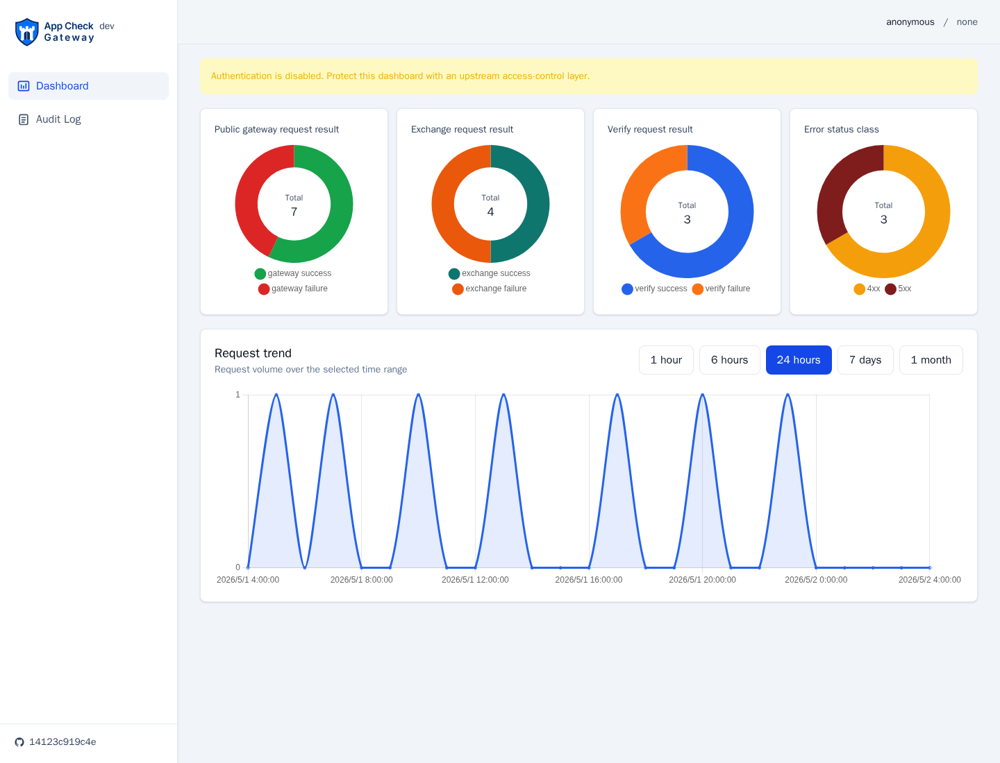
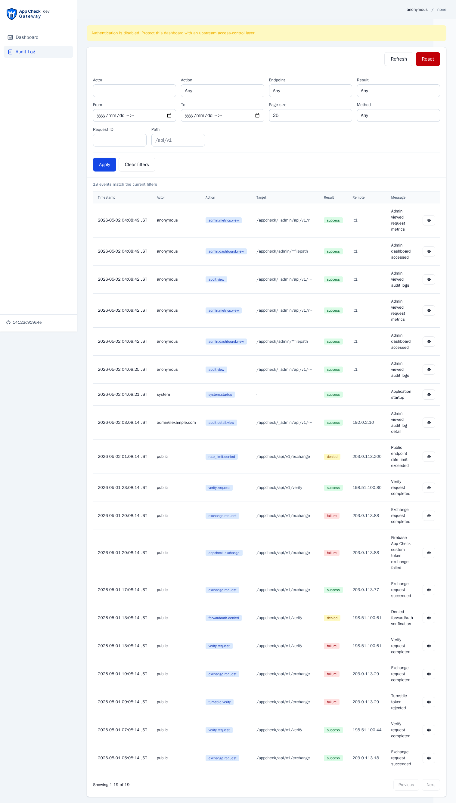

<p align="center">
  
</p>

`turnstile-appcheck-gateway` is a small Go/Gin service that bridges Cloudflare Turnstile and Firebase App Check Custom Provider. It exposes a frontend token exchange endpoint and a Traefik forwardAuth verification endpoint. The binary name is `turnstile-appcheck-gateway`; the Go module is `github.com/michibiki-io/turnstile-appcheck-gateway`.

## Table of Contents

- [Security Notice](#security-notice)
- [English](#english)
  - [API Reference](#english-api-reference)
  - [Architecture](#english-architecture)
  - [Configuration](#english-configuration)
  - [Admin Dashboard and Audit Logs](#english-admin-dashboard-and-audit-logs)
  - [Firebase Web CustomProvider](#english-firebase-web-customprovider)
  - [Development](#english-development)
  - [Build](#english-build)
- [日本語](#日本語)
  - [API リファレンス](#api-リファレンス)
  - [アーキテクチャ](#アーキテクチャ)
  - [設定](#設定)
  - [管理ダッシュボードと監査ログ](#管理ダッシュボードと監査ログ)
  - [Firebase Web CustomProvider](#firebase-web-customprovider)
  - [開発起動](#開発起動)
  - [ビルド](#ビルド)
- [References](#references)

## Security Notice

> [!WARNING]
> `turnstile-appcheck-gateway` handles security-sensitive token exchange and verification flows.
> Do not log or expose `TURNSTILE_SECRET_KEY`, submitted Turnstile response tokens, Firebase App Check tokens, Firebase custom tokens, service account JSON, Authorization headers, cookies, or raw request bodies.
>
> The admin dashboard supports `ADMIN_AUTH_MODE=none` for deployments already protected by a trusted upstream access-control layer. This mode does not protect the dashboard inside this service. Do not expose `{SUBPATH}/admin/` or `{SUBPATH}/_admin/` directly to the public internet when `none` mode is enabled.
>
> `turnstile-appcheck-gateway` は security-sensitive な token exchange / verification flow を扱います。
> `TURNSTILE_SECRET_KEY`、送信された Turnstile response token、Firebase App Check token、Firebase custom token、service account JSON、Authorization header、cookie、raw request body をログ出力・公開しないでください。
>
> 管理ダッシュボードの `ADMIN_AUTH_MODE=none` は、trusted upstream access-control layer で保護済みの構成向けです。この mode は service 内で dashboard を保護しません。`none` mode では `{SUBPATH}/admin/` と `{SUBPATH}/_admin/` を public internet に直接公開しないでください。

## English

### English API Reference

The service exposes the following public endpoints:

- `POST {SUBPATH}/api/v1/exchange` (default: `/appcheck/api/v1/exchange`)
- `ANY  {SUBPATH}/api/v1/verify` (default: `/appcheck/api/v1/verify`)
- `GET /healthz`
- `GET /readyz`

When the admin dashboard is enabled, the following administrator endpoints are also exposed under `{SUBPATH}`:

- `GET {SUBPATH}/admin/` -> embedded admin dashboard UI by default
- `GET {SUBPATH}/_admin/api/v1/me`
- `GET {SUBPATH}/_admin/api/v1/request-metrics`
- `GET {SUBPATH}/_admin/api/v1/audit-options`
- `GET {SUBPATH}/_admin/api/v1/audit-events`
- `GET {SUBPATH}/_admin/api/v1/audit-events/:id`
- `POST {SUBPATH}/_admin/api/v1/audit-events/reset`

`POST /exchange` example:

```bash
curl -i -X POST 'http://localhost:8080/appcheck/api/v1/exchange' \
  -H 'Content-Type: application/json' \
  -d '{
    "turnstileToken": "token-from-client",
    "limitedUse": false
  }'
```

Successful response:

```json
{
  "token": "eyJhbGciOiJSUzI1NiIs...",
  "expireTimeMillis": 1735689600000
}
```

Traefik forwardAuth example:

```yaml
http:
  middlewares:
    appcheck-forward-auth:
      forwardAuth:
        address: "http://turnstile-appcheck-gateway:8080/appcheck/api/v1/verify"
        trustForwardHeader: true
        authResponseHeaders:
          - X-AppCheck-Verified
          - X-AppCheck-AppID
```

Traefik treats 2xx responses as allow and non-2xx responses as deny.

### English Architecture

`POST {SUBPATH}/api/v1/exchange` is called by the frontend:

1. Receive a Turnstile token from the frontend.
2. Verify the token with Cloudflare Siteverify.
3. Generate a Firebase App Check custom token JWT.
4. Exchange it through Firebase App Check REST `exchangeCustomToken`.
5. Return `token + expireTimeMillis` in the shape expected by `CustomProvider.getToken()`.

`ANY {SUBPATH}/api/v1/verify` is called by Traefik forwardAuth:

1. Read the App Check token from `X-Firebase-AppCheck` by default.
2. Verify it with the Firebase Admin Go SDK.
3. Return the configured success status on valid tokens.
4. Return the configured failure status on missing or invalid tokens.

Repository layout:

```text
cmd/turnstile-appcheck-gateway/main.go
internal/config
internal/httpserver
internal/handlers
internal/turnstile
internal/firebaseappcheck
internal/auth
internal/middleware
internal/model
internal/logging
internal/errors
internal/health
internal/audit
internal/admin
internal/adminui
frontend
docs/images
```

### English Configuration

Configuration is read from environment variables. Use [.env.example](.env.example) for a standalone service run and [dev/.env.example](dev/.env.example) for the development Compose stack.

| Variable | Required | Default | Description |
|---|---|---:|---|
| `APPCHECK_SUBPATH` | optional | `/appcheck` | API subpath |
| `HTTP_ADDR` | optional | `:8080` | listen address |
| `TURNSTILE_SECRET_KEY` | required | - | Turnstile secret key |
| `TURNSTILE_SITEVERIFY_URL` | optional | `https://challenges.cloudflare.com/turnstile/v0/siteverify` | Siteverify URL |
| `FIREBASE_PROJECT_ID` | required | - | Firebase project ID |
| `FIREBASE_APP_ID` | conditionally required | - | Firebase app ID when `FIREBASE_APP_RESOURCE` is not set |
| `FIREBASE_APP_RESOURCE` | optional | - | Direct `projects/{project}/apps/{appId}` resource |
| `GOOGLE_SERVICE_ACCOUNT_JSON` | conditionally required | - | raw JSON, including multiline or escaped `\n` |
| `GOOGLE_SERVICE_ACCOUNT_JSON_BASE64` | conditionally required | - | base64 JSON, preferred over raw JSON |
| `LOG_LEVEL` | optional | `info` | `debug`, `info`, `warn`, or `error` |
| `REQUEST_TIMEOUT` | optional | `10s` | external request timeout |
| `APPCHECK_TOKEN_TTL` | optional | `30m` | App Check token TTL, from `30m` to `168h` |
| `ALLOWED_EXCHANGE_ORIGINS` | optional | - | comma-separated Origin allow-list for `/exchange` |
| `TRUST_PROXY_HEADERS` | optional | `false` | use forwarded headers for remote IP extraction |
| `VERIFY_HEADER_NAME` | optional | `X-Firebase-AppCheck` | header name read by `/verify` |
| `VERIFY_SUCCESS_STATUS` | optional | `204` | 2xx status returned by successful `/verify` |
| `VERIFY_FAILURE_STATUS` | optional | `401` | non-2xx status returned by failed `/verify` |
| `HEALTH_PATH` | optional | `/healthz` | health endpoint path |
| `READY_PATH` | optional | `/readyz` | readiness endpoint path |
| `ADMIN_DASHBOARD_ENABLED` | optional | `true` | enable admin dashboard |
| `ADMIN_BASE_PATH` | optional | `/admin` | admin UI path under `{SUBPATH}` |
| `ADMIN_AUDIT_TIMESTAMP_FORMAT` | optional | `2006-01-02 15:04:05 MST` | Go time layout for audit timestamps |
| `ADMIN_AUDIT_TIMESTAMP_TIMEZONE` | optional | `Asia/Tokyo` | dashboard audit timestamp timezone |
| `ADMIN_AUTH_MODE` | optional | `header` | `header` or `none` |
| `ADMIN_AUTH_USER_HEADER` | optional | `X-Forwarded-User` | trusted upstream user header |
| `ADMIN_AUTH_EMAIL_HEADER` | optional | `X-Forwarded-Email` | trusted upstream email header |
| `ADMIN_AUTH_GROUPS_HEADER` | optional | `X-Forwarded-Groups` | trusted upstream groups header |
| `ADMIN_ALLOWED_USERS` | optional | - | comma-separated allowed admin users |
| `ADMIN_ALLOWED_GROUPS` | optional | `gateway-admins` | comma-separated allowed admin groups |
| `AUDIT_ENABLED` | optional | `true` | enable SQLite audit logging |
| `AUDIT_SQLITE_PATH` | optional | `/var/lib/turnstile-appcheck-gateway/audit.db` | SQLite audit database path |
| `AUDIT_RETENTION_DAYS` | optional | `90` | retention cleanup days; `0` disables cleanup |
| `RATE_LIMIT_ENABLED` | optional | `true` | in-memory rate limit for `/exchange` and `/verify` |
| `RATE_LIMIT_REQUESTS` | optional | `120` | requests per rate limit window |
| `RATE_LIMIT_WINDOW` | optional | `1m` | rate limit window |

Public `/exchange` requests use strict JSON decoding with unknown fields rejected and a capped request body. `turnstileToken` is required and length-limited. Public `/exchange` and `/verify` requests are protected by a lightweight in-memory rate limiter. In multi-instance deployments, each instance keeps its own counters.

`/exchange` does not implement idempotency. Turnstile response tokens and App Check tokens are short-lived, and replaying the same token-exchange payload can conflict with the external validation flow. Failed client attempts should obtain a fresh Turnstile token before retrying.

### English Admin Dashboard and Audit Logs

`turnstile-appcheck-gateway` can serve a lightweight administrator dashboard at `{SUBPATH}{ADMIN_BASE_PATH}/` (default: `/appcheck/admin/`). The dashboard uses a persistent left sidebar with `Dashboard` and `Audit Log` pages.

Dashboard view:



Audit log view:



The Dashboard page shows gateway request result, exchange request result, verify request result, error status class doughnut charts, and a request trend chart. The trend range can be switched between `1 hour`, `6 hours`, `24 hours`, `7 days`, and `1 month`.

The Audit Log page provides server-side filters for actor, action, endpoint, result, from, to, page size, method, request ID, and path. It also provides pagination, a detail modal, and a guarded reset dialog. `POST /_admin/api/v1/audit-events/reset` requires `{"confirmation":"RESET"}`; existing audit events are deleted and a new `audit.reset` marker remains visible.

Audit events are stored in SQLite when `AUDIT_ENABLED=true`. Persist `/var/lib/turnstile-appcheck-gateway` in containers or Kubernetes when audit history must survive restarts. `AUDIT_RETENTION_DAYS` deletes older events at startup when the value is greater than zero.

Authentication modes:

- `header`: the service trusts identity headers injected by an upstream auth layer. Access is allowed only when `ADMIN_ALLOWED_USERS` or `ADMIN_ALLOWED_GROUPS` matches. Missing identity returns `401`; non-admin identity returns `403`.
- `none`: the service performs no dashboard authentication. The UI shows a visible warning banner. This mode must be protected by upstream access control such as ingress auth, reverse-proxy auth, oauth2-proxy, Authelia, VPN-only exposure, or Basic Auth. Do not expose it directly to the public internet.

Audit logging intentionally avoids sensitive data. It records operational metadata such as timestamp, actor, action, method, path, endpoint, result, status code, request ID, duration, remote address, user agent summary, high-level error code/message, `limitedUse`, and upstream service name. It does not store Turnstile secret keys, submitted Turnstile response tokens, Firebase App Check tokens, Firebase custom tokens, service account JSON, Authorization headers, cookies, raw request bodies, or full external API responses.

The dashboard displays build version and commit hash. Pass `BUILD_VERSION` and `BUILD_COMMIT` during Docker build to populate the sidebar version and GitHub commit link.

### English Firebase Web CustomProvider

`/exchange` is called from the frontend. The Turnstile site key is public and belongs in frontend configuration. Never embed the Turnstile secret key in frontend code.

```bash
# Vite example
VITE_TURNSTILE_SITE_KEY=0x4AAAA...
```

```javascript
import { initializeAppCheck, CustomProvider } from "firebase/app-check";

const TURNSTILE_SITE_KEY = import.meta.env.VITE_TURNSTILE_SITE_KEY;
let widgetId;

function ensureTurnstileWidget() {
  if (widgetId !== undefined) return widgetId;
  widgetId = turnstile.render("#turnstile-widget", {
    sitekey: TURNSTILE_SITE_KEY,
  });
  return widgetId;
}

const provider = new CustomProvider({
  getToken: async () => {
    const id = ensureTurnstileWidget();
    const turnstileToken = turnstile.getResponse(id);
    if (!turnstileToken) {
      throw new Error("turnstile token is empty");
    }

    const res = await fetch("/appcheck/api/v1/exchange", {
      method: "POST",
      headers: { "Content-Type": "application/json" },
      body: JSON.stringify({
        turnstileToken,
        limitedUse: false,
      }),
    });

    if (!res.ok) {
      throw new Error("failed to exchange app check token");
    }

    const data = await res.json();
    return {
      token: data.token,
      expireTimeMillis: data.expireTimeMillis,
    };
  },
});

initializeAppCheck(firebaseApp, {
  provider,
  isTokenAutoRefreshEnabled: true,
});
```

```html
<script src="https://challenges.cloudflare.com/turnstile/v0/api.js?render=explicit" async defer></script>
<div id="turnstile-widget"></div>
```

### English Development

Run the service with Docker:

```bash
cp .env.example .env
docker build -t turnstile-appcheck-gateway:local .
docker run --rm -p 8080:8080 --env-file .env turnstile-appcheck-gateway:local
```

Persist SQLite audit logs:

```bash
docker run --rm -p 8080:8080 --env-file .env \
  -v "$PWD/.data/turnstile-appcheck-gateway:/var/lib/turnstile-appcheck-gateway" \
  turnstile-appcheck-gateway:local
```

Run with Go directly:

```bash
go run ./cmd/turnstile-appcheck-gateway
```

Run the Compose verification environment:

```bash
cp dev/.env.example dev/.env
docker compose --env-file dev/.env -f dev/docker-compose.yml up --build -d
```

- frontend: `http://localhost:8080/`
- protected backend: `http://localhost:8080/backend`
- Traefik dashboard: `http://localhost:8088/`
- admin dashboard: `http://localhost:8080/appcheck/admin/#dashboard`

Rebuild the embedded admin dashboard assets locally:

```bash
cd frontend
npm install
npm run check
npm run build
```

Run tests:

```bash
go test ./...
```

When local Go is unavailable:

```bash
docker run --rm -v "$PWD":/src -w /src golang:1.26.2 sh -lc '/usr/local/go/bin/go test ./...'
```

### English Build

```bash
docker build -t turnstile-appcheck-gateway:local .
```

The Docker image runs frontend checks/build, Go tests, and Go binary build during the build stages. The built Svelte admin UI is embedded in the Go binary.

Pass build metadata into the image:

```bash
docker build \
  --build-arg BUILD_VERSION=0.1.0 \
  --build-arg BUILD_COMMIT="$(git rev-parse HEAD)" \
  -t turnstile-appcheck-gateway:local .
```

Multi-arch build example:

```bash
docker buildx build \
  --builder multiarch \
  --pull \
  --build-arg BUILD_VERSION=0.1.0 \
  --build-arg BUILD_COMMIT="$(git rev-parse HEAD)" \
  -t michibiki/turnstile-appcheck-gateway:0.1.0 \
  --platform=linux/amd64,linux/arm64 \
  --provenance=mode=max \
  --sbom=true \
  --push \
  ./
```

Release automation runs for Pull Requests merged from `feature/**` into `main`. It computes the next release version from PR title/body and commit messages, creates a `vX.Y.Z` tag, publishes GHCR images, and creates a GitHub Release.

## 日本語

`turnstile-appcheck-gateway` は Cloudflare Turnstile と Firebase App Check Custom Provider を連携するための小さな Go/Gin サービスです。frontend token exchange endpoint と Traefik forwardAuth verification endpoint を提供します。起動 binary 名は `turnstile-appcheck-gateway`、Go module は `github.com/michibiki-io/turnstile-appcheck-gateway` です。

### API リファレンス

このサービスは以下の public endpoint を提供します。

- `POST {SUBPATH}/api/v1/exchange` (既定: `/appcheck/api/v1/exchange`)
- `ANY  {SUBPATH}/api/v1/verify` (既定: `/appcheck/api/v1/verify`)
- `GET /healthz`
- `GET /readyz`

管理ダッシュボードが有効な場合は、`{SUBPATH}` 配下に以下の管理者向け endpoint も公開されます。

- `GET {SUBPATH}/admin/` -> デフォルトの埋め込み管理ダッシュボード UI
- `GET {SUBPATH}/_admin/api/v1/me`
- `GET {SUBPATH}/_admin/api/v1/request-metrics`
- `GET {SUBPATH}/_admin/api/v1/audit-options`
- `GET {SUBPATH}/_admin/api/v1/audit-events`
- `GET {SUBPATH}/_admin/api/v1/audit-events/:id`
- `POST {SUBPATH}/_admin/api/v1/audit-events/reset`

`POST /exchange` の例:

```bash
curl -i -X POST 'http://localhost:8080/appcheck/api/v1/exchange' \
  -H 'Content-Type: application/json' \
  -d '{
    "turnstileToken": "token-from-client",
    "limitedUse": false
  }'
```

成功レスポンス:

```json
{
  "token": "eyJhbGciOiJSUzI1NiIs...",
  "expireTimeMillis": 1735689600000
}
```

Traefik forwardAuth 設定例:

```yaml
http:
  middlewares:
    appcheck-forward-auth:
      forwardAuth:
        address: "http://turnstile-appcheck-gateway:8080/appcheck/api/v1/verify"
        trustForwardHeader: true
        authResponseHeaders:
          - X-AppCheck-Verified
          - X-AppCheck-AppID
```

Traefik forwardAuth は 2xx を許可、非2xx を拒否として扱います。

### アーキテクチャ

`POST {SUBPATH}/api/v1/exchange` は frontend が呼び出します。

1. frontend から Turnstile token を受信する。
2. Cloudflare Siteverify で server-side 検証する。
3. Firebase App Check custom token JWT を生成する。
4. Firebase App Check REST `exchangeCustomToken` で App Check token に交換する。
5. `CustomProvider.getToken()` がそのまま使える `token + expireTimeMillis` を返す。

`ANY {SUBPATH}/api/v1/verify` は Traefik forwardAuth が呼び出します。

1. 既定では `X-Firebase-AppCheck` から App Check token を取得する。
2. Firebase Admin Go SDK で token を検証する。
3. valid token なら設定された success status を返す。
4. missing / invalid token なら設定された failure status を返す。

ディレクトリ構成:

```text
cmd/turnstile-appcheck-gateway/main.go
internal/config
internal/httpserver
internal/handlers
internal/turnstile
internal/firebaseappcheck
internal/auth
internal/middleware
internal/model
internal/logging
internal/errors
internal/health
internal/audit
internal/admin
internal/adminui
frontend
docs/images
```

### 設定

設定は環境変数から読み込みます。単体起動では [.env.example](.env.example)、開発用 Compose stack では [dev/.env.example](dev/.env.example) を使ってください。

| 変数 | 必須 | 既定値 | 説明 |
|---|---|---:|---|
| `APPCHECK_SUBPATH` | 任意 | `/appcheck` | API subpath |
| `HTTP_ADDR` | 任意 | `:8080` | listen address |
| `TURNSTILE_SECRET_KEY` | 必須 | - | Turnstile secret key |
| `TURNSTILE_SITEVERIFY_URL` | 任意 | `https://challenges.cloudflare.com/turnstile/v0/siteverify` | Siteverify URL |
| `FIREBASE_PROJECT_ID` | 必須 | - | Firebase project ID |
| `FIREBASE_APP_ID` | 条件付き必須 | - | `FIREBASE_APP_RESOURCE` 未指定時の Firebase app ID |
| `FIREBASE_APP_RESOURCE` | 任意 | - | `projects/{project}/apps/{appId}` resource を直接指定 |
| `GOOGLE_SERVICE_ACCOUNT_JSON` | 条件付き必須 | - | raw JSON。複数行または escaped `\n` に対応 |
| `GOOGLE_SERVICE_ACCOUNT_JSON_BASE64` | 条件付き必須 | - | base64 JSON。raw JSON より優先 |
| `LOG_LEVEL` | 任意 | `info` | `debug`、`info`、`warn`、`error` |
| `REQUEST_TIMEOUT` | 任意 | `10s` | 外部 request timeout |
| `APPCHECK_TOKEN_TTL` | 任意 | `30m` | App Check token TTL。`30m` から `168h` |
| `ALLOWED_EXCHANGE_ORIGINS` | 任意 | - | `/exchange` の Origin allow-list。カンマ区切り |
| `TRUST_PROXY_HEADERS` | 任意 | `false` | remote IP 抽出に forwarded header を使う |
| `VERIFY_HEADER_NAME` | 任意 | `X-Firebase-AppCheck` | `/verify` が読む header 名 |
| `VERIFY_SUCCESS_STATUS` | 任意 | `204` | `/verify` 成功時の 2xx status |
| `VERIFY_FAILURE_STATUS` | 任意 | `401` | `/verify` 失敗時の non-2xx status |
| `HEALTH_PATH` | 任意 | `/healthz` | health endpoint path |
| `READY_PATH` | 任意 | `/readyz` | readiness endpoint path |
| `ADMIN_DASHBOARD_ENABLED` | 任意 | `true` | 管理ダッシュボードを有効化 |
| `ADMIN_BASE_PATH` | 任意 | `/admin` | `{SUBPATH}` 配下の管理 UI path |
| `ADMIN_AUDIT_TIMESTAMP_FORMAT` | 任意 | `2006-01-02 15:04:05 MST` | audit timestamp 表示用 Go time layout |
| `ADMIN_AUDIT_TIMESTAMP_TIMEZONE` | 任意 | `Asia/Tokyo` | dashboard audit timestamp timezone |
| `ADMIN_AUTH_MODE` | 任意 | `header` | `header` または `none` |
| `ADMIN_AUTH_USER_HEADER` | 任意 | `X-Forwarded-User` | trusted upstream user header |
| `ADMIN_AUTH_EMAIL_HEADER` | 任意 | `X-Forwarded-Email` | trusted upstream email header |
| `ADMIN_AUTH_GROUPS_HEADER` | 任意 | `X-Forwarded-Groups` | trusted upstream groups header |
| `ADMIN_ALLOWED_USERS` | 任意 | - | 管理者 user のカンマ区切り一覧 |
| `ADMIN_ALLOWED_GROUPS` | 任意 | `gateway-admins` | 管理者 group のカンマ区切り一覧 |
| `AUDIT_ENABLED` | 任意 | `true` | SQLite audit logging を有効化 |
| `AUDIT_SQLITE_PATH` | 任意 | `/var/lib/turnstile-appcheck-gateway/audit.db` | SQLite audit database path |
| `AUDIT_RETENTION_DAYS` | 任意 | `90` | retention cleanup 日数。`0` で無効 |
| `RATE_LIMIT_ENABLED` | 任意 | `true` | `/exchange` と `/verify` の in-memory rate limit |
| `RATE_LIMIT_REQUESTS` | 任意 | `120` | rate limit window あたりの request 上限 |
| `RATE_LIMIT_WINDOW` | 任意 | `1m` | rate limit window |

public `/exchange` request は strict JSON decoding を使い、unknown field を拒否し、request body size を制限します。`turnstileToken` は必須で length limit があります。public `/exchange` と `/verify` は軽量な in-memory rate limiter で保護されます。multi-instance 構成では instance ごとに counter を持ちます。

`/exchange` は idempotency を実装していません。Turnstile response token と App Check token は短命で、同じ token-exchange payload の replay は外部検証 flow と相性がよくありません。失敗時は client が新しい Turnstile token を取得して再試行してください。

### 管理ダッシュボードと監査ログ

`turnstile-appcheck-gateway` は `{SUBPATH}{ADMIN_BASE_PATH}/`（既定: `/appcheck/admin/`）で軽量な管理者向け dashboard を配信できます。dashboard は左 sidebar に `Dashboard` と `Audit Log` を持つ構成です。

Dashboard view:


Audit log view:


Dashboard page は gateway request result、exchange request result、verify request result、error status class の doughnut chart と request trend chart を表示します。trend range は `1 hour`、`6 hours`、`24 hours`、`7 days`、`1 month` を切り替えられます。

Audit Log page は actor、action、endpoint、result、from、to、page size、method、request ID、path の server-side filter、pagination、detail modal、確認付き reset dialog を提供します。`POST /_admin/api/v1/audit-events/reset` は `{"confirmation":"RESET"}` を要求し、既存 audit event を削除したあと `audit.reset` marker を 1 件残します。

`AUDIT_ENABLED=true` の場合、audit event は SQLite に保存されます。container / Kubernetes で restart 後も履歴を残す場合は `/var/lib/turnstile-appcheck-gateway` を永続 volume として mount してください。`AUDIT_RETENTION_DAYS` が 1 以上なら、起動時に指定日数より古い event を削除します。

認証モード:

- `header`: upstream auth layer が付与した identity header を信頼します。`ADMIN_ALLOWED_USERS` または `ADMIN_ALLOWED_GROUPS` に一致した場合だけ許可します。identity が無ければ `401`、admin 条件に合わなければ `403` を返します。
- `none`: service は dashboard の認証を行いません。UI には警告 banner が表示されます。この mode は ingress auth、reverse proxy auth、oauth2-proxy、Authelia、VPN-only exposure、Basic Auth など、必ず upstream access control で保護してください。public internet に直接公開してはいけません。

audit logging は機密情報を保存しない設計です。記録するのは timestamp、actor、action、method、path、endpoint、result、status code、request ID、duration、remote address、user agent summary、高レベルな error code/message、`limitedUse`、upstream service name などの運用 metadata です。Turnstile secret key、送信された Turnstile response token、Firebase App Check token、Firebase custom token、service account JSON、Authorization header、cookie、raw request body、full external API response は保存しません。

dashboard には build version と commit hash が表示されます。Docker build 時に `BUILD_VERSION` と `BUILD_COMMIT` を渡すと、sidebar の version と GitHub commit link に反映されます。

### Firebase Web CustomProvider

`/exchange` は frontend から呼び出します。Turnstile site key は公開情報なので frontend configuration に置きます。Turnstile secret key は frontend code に埋め込まないでください。

```bash
# Vite example
VITE_TURNSTILE_SITE_KEY=0x4AAAA...
```

```javascript
import { initializeAppCheck, CustomProvider } from "firebase/app-check";

const TURNSTILE_SITE_KEY = import.meta.env.VITE_TURNSTILE_SITE_KEY;
let widgetId;

function ensureTurnstileWidget() {
  if (widgetId !== undefined) return widgetId;
  widgetId = turnstile.render("#turnstile-widget", {
    sitekey: TURNSTILE_SITE_KEY,
  });
  return widgetId;
}

const provider = new CustomProvider({
  getToken: async () => {
    const id = ensureTurnstileWidget();
    const turnstileToken = turnstile.getResponse(id);
    if (!turnstileToken) {
      throw new Error("turnstile token is empty");
    }

    const res = await fetch("/appcheck/api/v1/exchange", {
      method: "POST",
      headers: { "Content-Type": "application/json" },
      body: JSON.stringify({
        turnstileToken,
        limitedUse: false,
      }),
    });

    if (!res.ok) {
      throw new Error("failed to exchange app check token");
    }

    const data = await res.json();
    return {
      token: data.token,
      expireTimeMillis: data.expireTimeMillis,
    };
  },
});

initializeAppCheck(firebaseApp, {
  provider,
  isTokenAutoRefreshEnabled: true,
});
```

```html
<script src="https://challenges.cloudflare.com/turnstile/v0/api.js?render=explicit" async defer></script>
<div id="turnstile-widget"></div>
```

### 開発起動

Docker で service を起動します。

```bash
cp .env.example .env
docker build -t turnstile-appcheck-gateway:local .
docker run --rm -p 8080:8080 --env-file .env turnstile-appcheck-gateway:local
```

SQLite audit log を永続化する場合:

```bash
docker run --rm -p 8080:8080 --env-file .env \
  -v "$PWD/.data/turnstile-appcheck-gateway:/var/lib/turnstile-appcheck-gateway" \
  turnstile-appcheck-gateway:local
```

Go で直接起動する場合:

```bash
go run ./cmd/turnstile-appcheck-gateway
```

開発用 Compose 環境を起動する場合:

```bash
cp dev/.env.example dev/.env
docker compose --env-file dev/.env -f dev/docker-compose.yml up --build -d
```

- frontend: `http://localhost:8080/`
- protected backend: `http://localhost:8080/backend`
- Traefik dashboard: `http://localhost:8088/`
- admin dashboard: `http://localhost:8080/appcheck/admin/#dashboard`

埋め込み管理ダッシュボード assets をローカルで再生成する場合:

```bash
cd frontend
npm install
npm run check
npm run build
```

test:

```bash
go test ./...
```

local Go が無い場合:

```bash
docker run --rm -v "$PWD":/src -w /src golang:1.26.2 sh -lc '/usr/local/go/bin/go test ./...'
```

### ビルド

```bash
docker build -t turnstile-appcheck-gateway:local .
```

Docker build stage では frontend check/build、Go test、Go binary build を実行します。build 済み Svelte admin UI は Go binary に embed されます。

build metadata を image に渡す場合:

```bash
docker build \
  --build-arg BUILD_VERSION=0.1.0 \
  --build-arg BUILD_COMMIT="$(git rev-parse HEAD)" \
  -t turnstile-appcheck-gateway:local .
```

multi-arch build example:

```bash
docker buildx build \
  --builder multiarch \
  --pull \
  --build-arg BUILD_VERSION=0.1.0 \
  --build-arg BUILD_COMMIT="$(git rev-parse HEAD)" \
  -t michibiki/turnstile-appcheck-gateway:0.1.0 \
  --platform=linux/amd64,linux/arm64 \
  --provenance=mode=max \
  --sbom=true \
  --push \
  ./
```

Release automation は `feature/**` から `main` へ merge された Pull Request を契機に実行されます。PR title / body / commit messages から次の release version を計算し、`vX.Y.Z` tag、GHCR image、GitHub Release を作成します。

## References

- Firebase App Check custom provider (web)  
  https://firebase.google.com/docs/app-check/web/custom-provider
- Firebase App Check custom backend verification  
  https://firebase.google.com/docs/app-check/custom-resource-backend
- Firebase App Check REST exchangeCustomToken  
  https://firebase.google.com/docs/reference/appcheck/rest/v1/projects.apps/exchangeCustomToken
- Cloudflare Turnstile server-side validation  
  https://developers.cloudflare.com/turnstile/get-started/server-side-validation/
- Cloudflare reference implementations  
  https://github.com/cloudflare/turnstile-firebase-app-check-provider  
  https://github.com/cloudflare/turnstile-firebase-app-check
